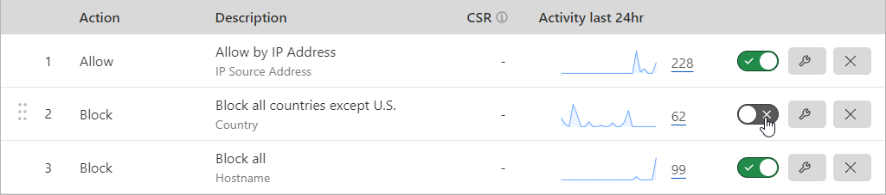

# Foundry VTT - Azure Terraform

Here's some Terraform code to provision artifacts used to self-host a Foundry Virtual Table Top server:

* Virtual Network
* Subnet(s) with Network Security Group
* Virtual Machine with public IP
    * SSH Public Key (replace with your own)
* 32 GB data drive
* Recovery Vault
* Storage account

You'll notice commented out sections in the tfvars and nsg.tf. These can be modified to scale up
when you are ready to host a game vs. just having it sitting around for world building. You may
need to adjust NSGs when you first stand up and provision the server. The idea would be to uncomment
the NSG rule "web-snet-nsg-foundry-in" so that you can gain access to the Foundry server prior to
implementing caddy (reverse proxy/TLS cert). I am using a personal (free) Cloudflare account for WAF
and DNS. Once caddy is working and your TLS cert was issued, you can re-run Terraform and apply the
lockdown to only allow Cloudflare ranges into the NSG for TCP ports 80/443.

I have 2 Cloudflare DNS records. One is "grey clouded/unproxied" to allow SSH. The other record is
"orange clouded/proxied" to secure access to the Foundry service.

I have three WAF rules in Cloudflare:

I toggle rule 2 on and 3 off when i'm ready to host a game. It blocks all countries except where my
players are located. Otherwise, I run with rules 1 and 3 toggled on to work on my worlds and reduce the
attack surface of Foundry. Of course if you need players to be able to hop in and out of the server at
any time, you would adjust these accordingly.

I have rclone configured on the server. There's a cron job that stops the Foundry service and synchs the
Foundry code and user data to the Azure storage account nightly.

[Foundry](https://foundryvtt.com/)

